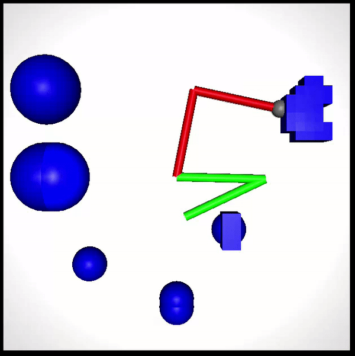

Content
1. [Short description](#short-description)
1. [Installation](#installation)
1. [Before run](#before-run)
1. [Run](#run)
    1. [Run without graphics](#run-without-graphics)
1. [Run with custom parameters](#run-with-custom-parameters)
    1. [Where are parameters used for launch project](#where-are-parameters-used-for-launch-project)
    1. [How to setup one scenario](#how-to-setup-one-scenario)
1. [Tools description](#tools-description)
    1. [Clusterizer](#clusterizer)
    1. [JSON generator](#json-generator)
    1. [XML autogen](#xml-autogen)
1. [Project description](#project-description)
    1. [Problem description](#problem-description)
    1. [Planner](#planner)
        1. [General description](#general-description)
        1. [A* algorithm](#a-algorithm)
        1. [Collision checking](#collision-checking)
    1. [Task generation](#task-generation)
    1. [Model](#model)
    1. [Interaction with mujoco](#interaction-with-mujoco)

# Short description
This simulator for manipulator motion planning developed based on the [mujoco](https://github.com/deepmind/mujoco) as simulator and library. It implements variations of A* algorithm. It can find pathes in 2D space for custom manipulators on custom scene and calculate runtime, cost of path and the number of iterations of algorithm A*. You can run set of tasks on your scene and slightly manipulate the heuristic. After solving task project can show simulation images in graphical window.



# Installation
This instruction is written for linux. Before start make sure that you have g++ compiler installed on your machine.  
To compile and run this project you need to install OpenGL (glfw) library

```
sudo apt update
sudo apt install libglfw3-dev
sudo apt install make
```

Then copy-paste two files from 'lib' folder libmujoco.so and libmujoco.so.2.3.2 to '/usr/lib' to install mujoco libraries

```
sudo cp lib/libmujoco.so /usr/lib/libmujoco.so
sudo cp lib/libmujoco.so.2.3.2 /usr/lib/libmujoco.so.2.3.2
```
Congradulations! You have completed installation.  

# Before run

This project uses some output files witch don't exist in github repository. To make all necessary folders run
```
./.github/build_structure
```
It will create empty folders in witch you can find output files after run: with logs and statistics.

# Run
For run on linux you can use 'run_linux' file. Execute this in the root of the repository.  
```
./run_linux
```

Or you can compile this using Makefile
```
make simulator
```

After this operation in the root of this repository you can find 'manipulator' file. Run it. 
```
./simulator
```

If you got into trouble with running some of this files, do this and try again:
```
chmod +x <execution_file>
```

## Run without graphics

If you has no monitor on your device (for example on virtual machine) you can't run project according to the instructions above. But you can whatever run project without graphics. To do this install following tool:
```
sudo apt update
sudo apt install xvfb
```

To run project execute command:
```
./run_monitorless
```

To run project on server using nohup execute command:
```
./run_server
```

# Run with custom parameters

## Where are the parameters used to run the project

At the start of the project, several scenaries are run sequentially. One scenario described in one .json file. This files is located in the `parameters/launch` folder and only files in this folder will be used to launch scenaries. And foles in subfolder of `parameters/launch` will be used to run project. All files sorted by alphabet (by relative path from root of repository) and will be run in this strong order. Also there is a folder `parameters/samples`. There is an example of json-file in this folder. 

Now there is a script `jsons_generator.py` in `tools` folder. You can change code and generate configs automatically just in the `parameters/launch` folder.

## How to setup one scenario

To setup one scenario you need to describe all fields in json, even you don't use several of their. (This update of project have planned). Below is a description of the fields, each field is named as "part_1.part_2.part_3" where "part_1" is name of this field on the first level of json, "part_2" - on the second, etc

- **model_filename: (string)** Use this parameter to choose scene - manipulator and obstacles. Write the path of file from the root of repository. In `models` folder you can find several scenes or create your xml-file of model.
- **algorithm.time_limit: (float)** Use this parameter to set time bound **in seconds**. You can set the maximum time that planner may spend on one task. If algorithm is not found solution during this time, it returns PATH NOT FOUND verdict.
- **algorithm.type: (integer)** You can choose type of algorithm. Now available:
    - 1 (A*)
    - 2 (Lazy A*)
- **algorithm.heuristic.weight: (float)** You can set weight of heuristic using this field.
- **taskset.use_random_tasks: (boolean)** Using this option you can turn on random generation of tasks. Set true if want generate taskset at random. In project there is constant seed and tasks not will be random at all, if you generate 2 random taskset with same other parameters, you will get same tasksets.
- **taskset.task_number: (integer)** You can set the number of generated random tasks if you want use random generated tasks. Doesn't affect if `taskset.use_random_tasks` = false
- **taskset.task_type: (integer)** You can choose kind of task with this parameter. Set correct parameter even if you choose taskset file. Without this parameter impossible to determine the type of task in the file. Now available two options:
    -  0 (TASK_STATE). In this case goal is full configuration, it is set by n rotation angles, where n is the number of joints.
    -  1 (TASK_POSITION). In this case goal is coordinates of end-effector, it is set by 2 floats. If you choose this option, the planner will find any goal with that end-effector coordinates.
- **taskset.taskset_filename: (string)** With this parameter you can set taskset if `taskset.use_random_tasks` = false in special format. You can generate it from csv using scripts `tools/clusterizer_state.py` and `tools/clusterizer_position.py` (see [tools description](#tools-description) for more information). Script depends of kind of task. And you have to set `taskset.task_type` which mathes the kind of tasks presented in taskset.
- **output.profiling: (string)** Set path for output file for profiling data for general functions of algorithm in csv format. 
- **output.statistics: (string)** Set path for output file for data about solutions of tasks: the number of expansions, runtime, cost of path etc in csv format.
- **output.taskset: (string)** Set path for output file for data about tasks: start configuration, goal, difficulty (not really good), cost of path, runtime in csv format. You can use this file and script `tools/clusterizer_*.py` to convert this data to input format of taskset. Using this output you can store random generated taskset.
- **output.configuration_space: (string)** Set path for output file for dump C-Space if dof = 2. Otherwise not affected.
- **output.paths_folder: (string)** Set folder to output found by manipulator paths on C-Space if dof = 2. In this folder will be created n files named "path_n", where n - is number of task starting from 0.
- **display_motion: (boolean)** If true, after plannig in success case programm will show animation of manipulator movements from start position to goal. Set true for demonstration and false for measurement of algorithm indicators. 

# Tools description

In this chapter are described scripts which make interaction with project easier. All scripts realized using python and it is not "scripts" in the usual sense. It is python code with variables just in top lines in code and to use it you need to change parameters in code and run file. This scripts created not to fully automate process of using project, but simplify it. All this scripts are located at `tools/` folder.

## Clusterizer

This script has the purpose to convert output taskset in csv format to input taskset in special human-readable format and clusterize tasks by runtime. You have to define `input_file`, `output_easy`, `output_medium`, `output_hard` filenames and `medium_threshold`, `hard_threshold` float variables. Script prints tasks witch was solved by less than `medium_threshold` seconds to `output_easy` file, between `medium_threshold` and `hard_threshold` to `output_medium` and other tasks to `output_hard` in special format. Also you have to define `dofs` variable and in `clusterizer_position` `dim` - number of dimensionals in the base space (2 for plane, 3 for space). And you have to use script `clusterizer_position` to process taskset with TASK_POSITION task and `clusterizer_state` to process taskset with TASK_STATE.

## JSON generator

`json_generator` is a script with no hidden logic and simply generates json-files for launching project. It generates filenames and settings. You have to define list of lengths of manipulator links - `length`, and describe obstacles in file `tools/args/obstacles.txt` in the following format: every row define [geom](https://mujoco.readthedocs.io/en/latest/XMLreference.html#body-geom) parameters of obstacle (instead of name and material). You can change path to "obstacle file" right in script.

## XML autogen

`xml_autogen` script is needed to generate model with simple manipulator and obstacles. Manipulator described by `length` list of sizes of every links. The len of list is dof. Obstacles is described in file `path_to_obstacles` in the following format: every row define [geom](https://mujoco.readthedocs.io/en/latest/XMLreference.html#body-geom) of obstacle instead of name and material. After run the script in `tools/` folder will appear xml file, wich you can copy-paste to mmodel folder and without changes run simulation with this scene.

# Project description

This chapter may no longer be relevant, but there is a project description in [this file](https://drive.google.com/file/d/1Kil5fVnv32S68pH_mOFf5xHwrki2B6zP/view?usp=drive_link)

## Problem description
We have a manipulator in space with obstacles and two positions of this manipulator: start and finish. It is required to plan the actions using which the manipulator will come from the start position to the finish.

## Planner

### General description
The most important class in this project is [ManipulatorPlanner](https://github.com/machine-solution/motion_planning_for_manipulators/blob/261f3460d69ccef7a86ff90b380b45a91f1aa76f/include/planner.h#L16). It solves problem in method [planSteps](https://github.com/machine-solution/motion_planning_for_manipulators/blob/261f3460d69ccef7a86ff90b380b45a91f1aa76f/include/planner.h#L30). This method must return solution with statistics and sequence of actions needed to reach finish from start.

### A* algorithm
A* algorithm is realized in two places: [node and tree](https://github.com/machine-solution/motion_planning_for_manipulators/blob/261f3460d69ccef7a86ff90b380b45a91f1aa76f/src/astar.cpp#L8) and [algorithm](https://github.com/machine-solution/motion_planning_for_manipulators/blob/261f3460d69ccef7a86ff90b380b45a91f1aa76f/src/planner.cpp#L183) in planner.\
It is planned to move algorithm to astar.cpp.

### Collision checking
For collision checking I use copy of original model on scene. Planner [gets this copy](https://github.com/machine-solution/motion_planning_for_manipulators/blob/261f3460d69ccef7a86ff90b380b45a91f1aa76f/src/main.cpp#L345) and uses it in [checkCollisionAction](https://github.com/machine-solution/motion_planning_for_manipulators/blob/261f3460d69ccef7a86ff90b380b45a91f1aa76f/src/planner.cpp#L36) and [checkCollision](https://github.com/machine-solution/motion_planning_for_manipulators/blob/261f3460d69ccef7a86ff90b380b45a91f1aa76f/src/planner.cpp#L22) methods.\
For speed I use [light_collision](https://github.com/machine-solution/motion_planning_for_manipulators/blob/261f3460d69ccef7a86ff90b380b45a91f1aa76f/src/light_mujoco.cpp#L96) function instead mujoco standard 'mj_step_1'. Code of this function was copied from mujoco source files and refactored to more light function. But it has one constraint: it works only for predefined pairs of geoms. It means that you have to define in model file witch pair of geoms we need to check on collision. It makes some of discomfort, but gains about 20% speeding up.

## Task generation
Now task generation is united with interactor and use only one function - [randomState](https://github.com/machine-solution/motion_planning_for_manipulators/blob/261f3460d69ccef7a86ff90b380b45a91f1aa76f/src/main.cpp#L215). This process very simple: manipulator strts with zero state and gets random finish. If it finds solution, it will get new random finish and start will be previous finish. If no, it gets new random finish without changing start.\
I'm planning to separate interaction and test generation in future.

## Model
For this project we can do manipulator model in xml format. To learn how to do this please read [xml reference](https://mujoco.readthedocs.io/en/latest/XMLreference.html).\
All models are located in 'model' directory.\
Now the easiest way to change model is execute   ```./simulator <filename>```   where filename is path to your model from root of repository.\
Another way to do this is change default filename [here](https://github.com/machine-solution/motion_planning_for_manipulators/blob/261f3460d69ccef7a86ff90b380b45a91f1aa76f/src/main.cpp#L14).

## Interaction with mujoco
All interaction planner and mujoco simulator in [planner_step](https://github.com/machine-solution/motion_planning_for_manipulators/blob/261f3460d69ccef7a86ff90b380b45a91f1aa76f/src/main.cpp#L197) function, which is being called in infinity loop of simulation.\
To simulate actions of manipulator I divided angles from 0 to pi on [worldUnits](https://github.com/machine-solution/motion_planning_for_manipulators/blob/261f3460d69ccef7a86ff90b380b45a91f1aa76f/include/global_defs.h#L8) - minimal angle to move.\
Planner can divide angles on another [units](https://github.com/machine-solution/motion_planning_for_manipulators/blob/261f3460d69ccef7a86ff90b380b45a91f1aa76f/include/global_defs.h#L5) and when interaction function gets next step, it move manipulator in step direction, but every interactor step move manipulator on one worlUnit and do this [unitSize](https://github.com/machine-solution/motion_planning_for_manipulators/blob/261f3460d69ccef7a86ff90b380b45a91f1aa76f/include/global_defs.h#L7) times.
