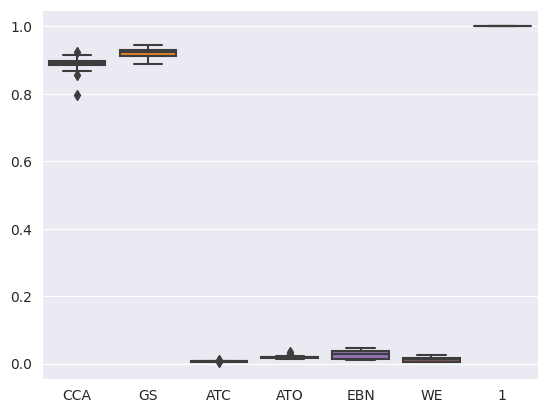
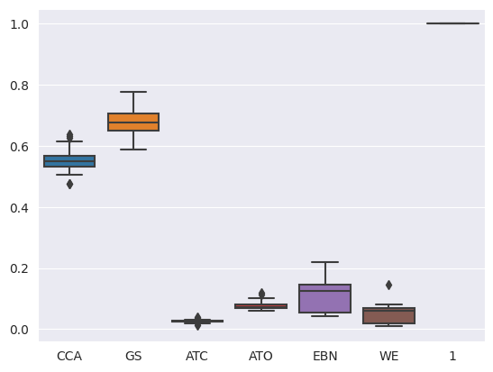
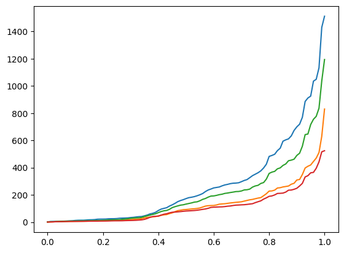

# Runtime distribution and light collisions

## Lazy collision checking

\
This is a boxplot with runtime distribution. Names in bottom is abbriviations of method names: CCA - checkCollisionAction, GS - generateSuccessors, ATC - addToclosed, ATO - addToOpen, EBN - extractBestNode, WE - was expanded. Runtime values is normed by whole runtime of algorithm. Box "1" shown to fixed scale.\
Chart shows whole runtime of function during all calls in every test case.\
In this boxplot we can see that collision checking function is extrimely slow. generateSuccessors is slow because it calls CCA.\

Collision checking worked this way: for every action it checks manipulator collisions in 8 positions between start and finish positions. It's about every 0.17 degrees. I have made an experiment and decreased the number of positions between for checking to 4, 2 and 1.\

Results: for 4 checks manipulator has encountered no obstacles in 100 tests and sped up.\
For 2 and 1 checks manipulator has encountered obstacles in 23 same tests. But with 1 check CCA runtime became much smaller.

\
\

## Light collision in mujoco

Second step in this experiment consisted in usage of more fast collision detection. I took source code of mujoco and refactor collision function to be faster.\
Two remarks:\
1. There is no public collision function in mujoco, only in source code and it is not recommended to use this functions, but it is used not for main simulation. I think it's ok to use it in copy of scene.
2. (If you have read descriptions about xml files). Function was refactored to be used only in predefined collision pairs because main algorithm in source code too hard to refactor it. It isn't matter as long as I use predefined format of collisions.

\
\

According to plots it has decreased runtime of collision checking.\

And plot of whole runtime quantiles to evaluate the impact of this changes in whole runtime, not only in CCA.\

\

Mean runtime statistics:\
4-checks mean: 269.3 ms\
1-checks mean: 128.5 ms\
4-checks + light mean: 201.2 ms\
1-checks + light mean: 107.4 ms

## Conclusion
All two changes sped up algorithm in 2.5 times, but lazy collision checking made several collisions in 23% tests. I think it doesn't matter because
1.  In real task I need to use buffer for obstacles to resist collisions made by phisical reasons.
2. In perspective I want to add in path cost counting distance to obstacles and in this scenario manipulator will have small chance to collide with obstacle because avoiding their more.
