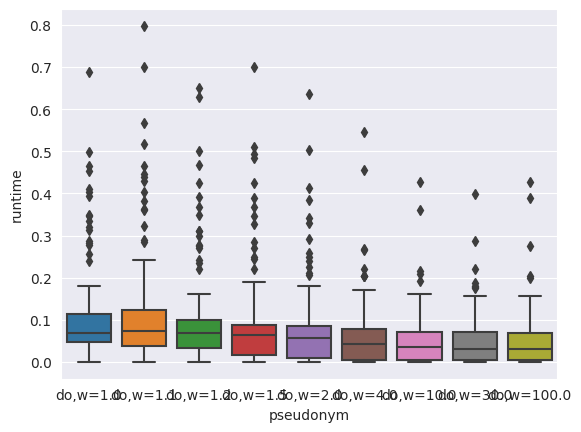
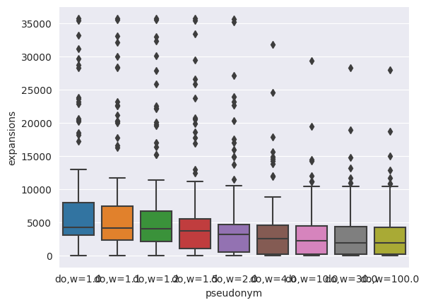
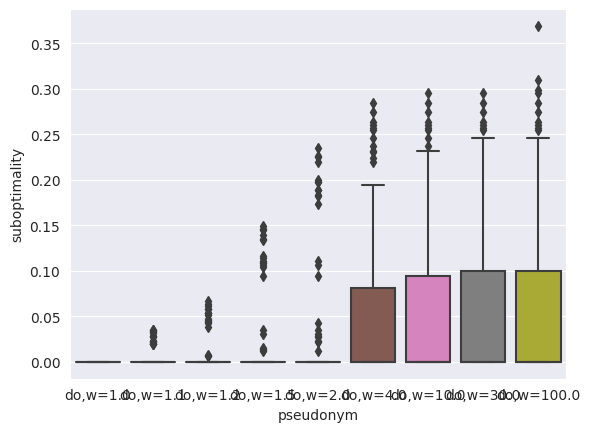
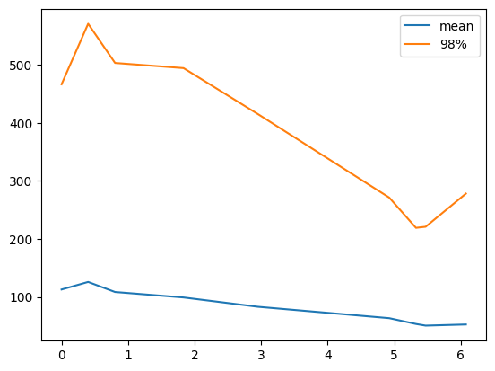

# weighted A* speeding up

## Introduction
To implement WA* I needed to change type of variable of path cost and I do some experiments to see witch type make more speed.
I saw that there no major difference between double and int and used double.

## Weight impact in 100 random tests
I generated 100 random tests and run WA* with weights (1.0, 1.1, 1.2, 1.5, 2.0, 4.0, 10.0, 30.0, 100.0).

\
This plot shows runtime (in seconds) in depending on weight.\
\
This plot shows expansions in depending on weight.\
\
And this plot shows suboptimality (in %) in depending on weight.\

You can see, that there are a lot of tests "out of boxes". These tests are hard, because an algorithm spends a lot of time to solve they. But there are many easy tests and plots shows mostly their statistics. But we can see, that increasing weight we decreasing runtime in average.

## Runtime-suboptimality trade-off

Next plot shows runtime-suboptimality trade-off in average. Point on this plot is a pair of average suboptimality (in %, horisontal axis) for fixed weight and average or 98%-quantile runtime for same weight.\
\
As you can see this plot almost two segments.

## Conclusions
1. I need to analyze only hard tests for more significant statistic.
2. A runtime-suboptimality trade-off almost linear.
