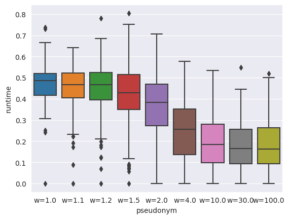
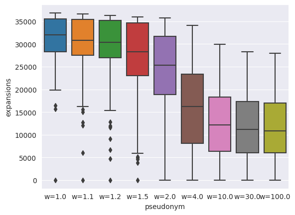
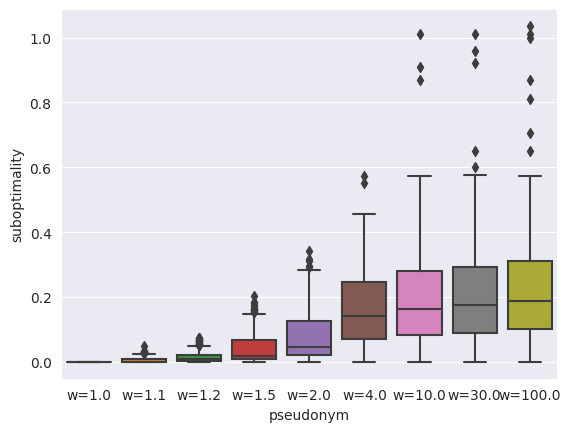
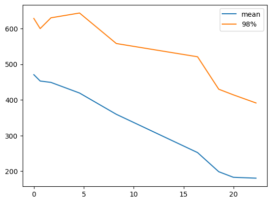

# Statistic of hard tests

## What are hard tests

I has clusterized 2-dof tests by runtime WA* with weight = 1.0. Hard tests are tests with runtime more than 0.4s. There are 200 hard tests in 5'000 random tests.

## Results
\
\
This are graphics of runtime and the number of expansions depending on weight. We can see that any significant effect appears with w=4.0 and w=10.0 seems optimal for runtime because with increasing w after 10.0 runtimes deacreasing very slow.\
\
This plot shows dependence suboptimality on weight. We can see that w=10.0 and more have same effect and in average with w=10.0 we get about 20%(exactly 18.5%) suboptimality but it can be more than 100% in several cases.

This plot shows runtime-suboptimality trade-off. In horisontal axis is shown suboptimality in percents, in vertical axis is shown runtime in ms. 

## Conclusion
1. In hard tests WA* gives significant effect with big weights.
2. We can excange about 20% suboptimatily for speeding up in about 2.5 times in hard tests.
