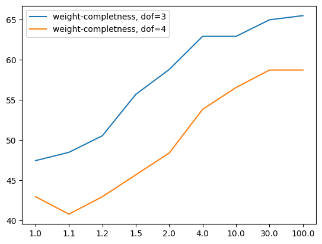

# Complete rate with 3-dof and 4-dof

## Introduction
With more dofs WA* works not perfect and with w=1.0 it can't solve all generated tests. According to this problem I decided to make several tests and calculate how many of this tests WA* can solve in 1s.

## Experiment
I have created about 200 random tests for 3- and 4-dof manipulators and run algorithm with several weights (like in past experiments). As I said, I used 1 second time budget for test and calculated percent of completed tests.\
\
I got this results. Plot shows weights in horisontal axis and completed test in vertical axis in percents. We can see, that 3-dof, as I expected, can solve more tests.

## Conclusions
WA* can solve from 47% to 66% random tests, but I think it isn't good because in previous description we take 200 hard tests in 5'000 random. It means, that hard tests in random about 4%. From this point of view WA* with more dofs works isn't good.  
