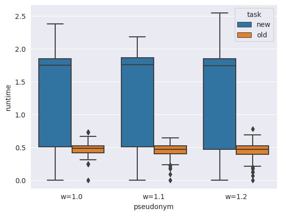
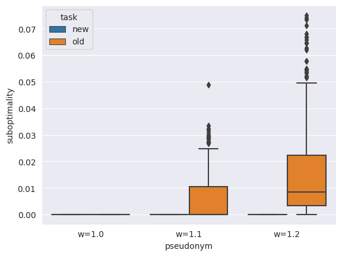
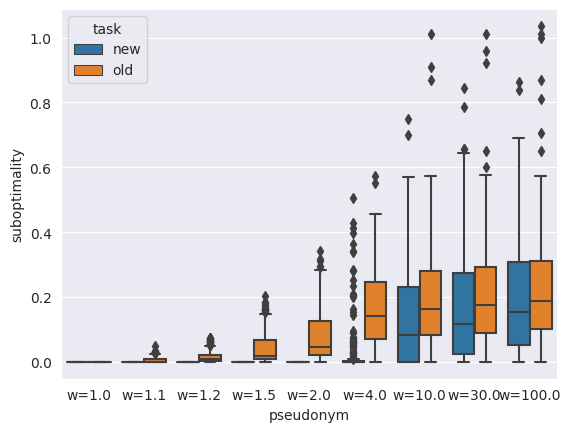
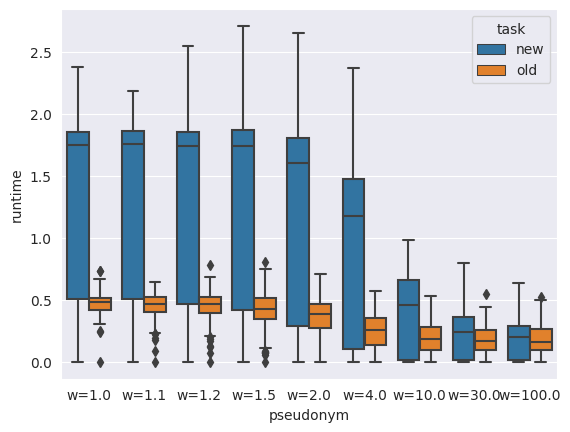
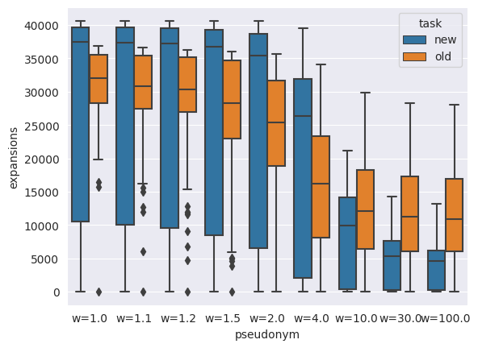

# New kind of tasks

## Problem definition
We have start position and final coordinates of end-effector. Problem in planning path to reach end-effector final position.
It is certain that we cannot exactly reach end position for any position because we discretized configuration space. In own worl problem in planning path to reach position of end-effector far not more than eps (now eps = 10^(-6)) from final position.

## Step 1 : it should works at least somehow

### What I do for step 1
I needed some abilities in this project to make this problem definition.
1. I need to control in A* condition "current position is goal", because previous 'if (current position == goal position)' already isn't works. I made isGoal method in AstarChecker (AstarChecker is class with methods A* use for planning. It helps configurate some steps in A* and not rewrite main A* logic).
2. Create heuristic for new problem definition. I calculated maximum distance whitch end-effector can overcome in one step and in heuristic function I devide distance from current end-effector and goal by this maximum end-effector step.
3. Generating tasks. Isn't closed question, but for first time I generate tasks by whole pos and use only end-effector position. This method gives garantees that any task will be solvable. Another advantage in ability to reuse already clusterized tests in the same format. But in future I need to generate task 'honestly'.
4. For new task create new methods, models (without green goal pos) and etc. This work I didn't make (because paragraph 3), but it can create more difficulties in future and needs much time.

### Comparation
I compared new A* tasks with old on old hard testset. There is one problem: a lot of test hard for the first problem definition isn't hard for the second in this map. In other hand I thought there are very difficult test in this statement because not best heuristic and set time budget 10 seconds for every weight.\
\
This plot shows how increased runtime in new task definition. There are two reasons: increased number of expansions and more slow calculations. To calculate end-effector pos I call mujoco function 'mj_forward'. May be I can rewrite light function for my situation.\
\
But in this plot we can see, that small weights give optimal solutions. Next plot show that only weight=4.0 and more give not optimal solutions.\
\
As we can see on next two plots new task definition with big wieght make almost same perfomance as old task. And the number of expansions are less. But it isn't achievement of algorithm - many of 'hard' for first problem tasks aren't 'hard' for second.\
\
\
At the end I say that one expansion takes more time in new task. I beleive I can improve it using low level optimizations.

### Conclusion step 1
1. New task works more slow and need speeding up by high and low level optimizations.
2. New task hard to implement in one step and I will continue integrating the second variant of test to project.